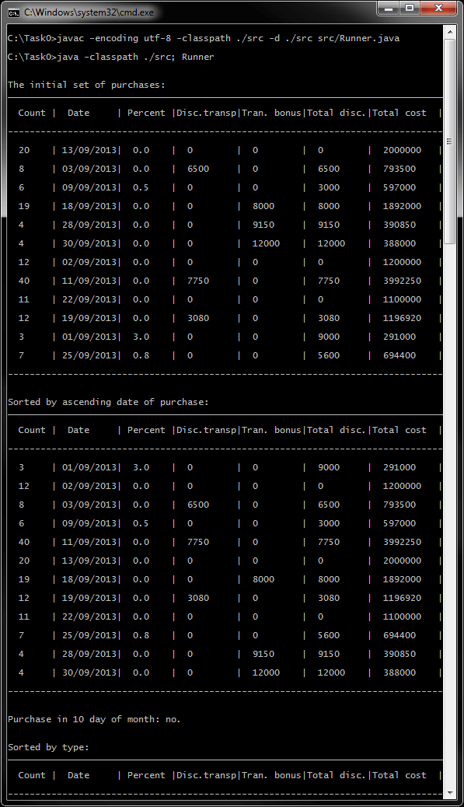
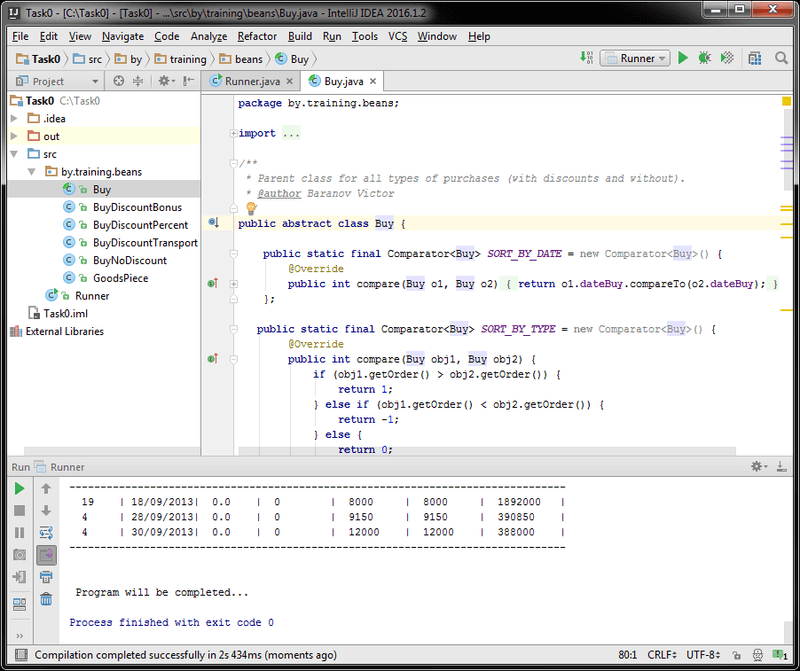
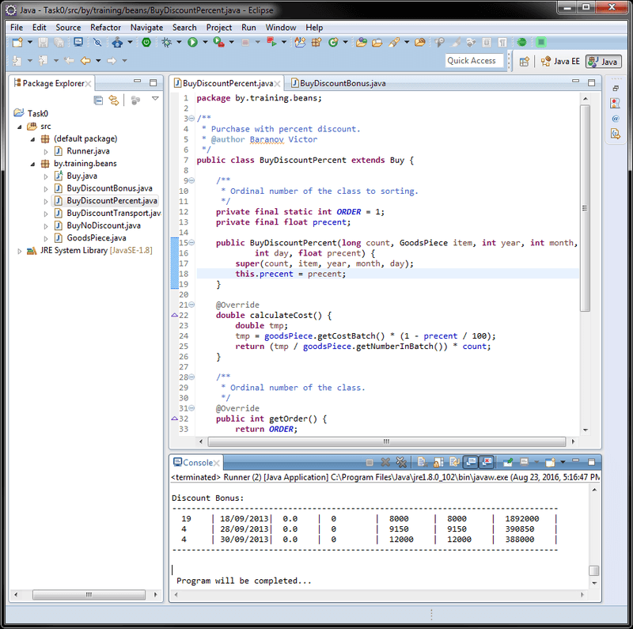

# Задание 0 - Основы (ООП, наследование)
[&lt; назад](../../../)  
<!--- *Прочтите это на другом языке:* *[~~English~~](README.en.md)*, **[Русский](README.md)**.  -->
Исходный код приложения предполагает запуск в JDK 7 (и выше).  
Также приложены инструкции по импорту и запуску проекта в IDE Eclipse, IDEA и NetBeans.

## Задание
Определить класс, описывающий покупку одного и того же штучного товара по одной и той же цене (в белорусских рублях) в течение одного месяца и содержащий сведения о дне покупки и количестве приобретенных единиц.  
Допускаются еще три варианта покупок:
 * 1. со скидкой, задаваемой процентом от стоимости  
 (стоимость покупки = стоимость партии товара * (1 – процент скидки/100));
 * 2. с фиксированной (постоянной) скидкой за транспортные расходы на доставку товара  
 (стоимость покупки = стоимость партии товара – транспортные расходы).
 * 3. с бонусом в виде другого товара в единичном количестве  
 (стоимость покупки = стоимость партии товара – цена бонусного товара).

Создать консольное приложение, в котором выполнить следующие задания:
 * определить набор покупок различного вида (не менее 10);
 * отсортировать покупки по возрастанию дня покупки;
 * вывести на консоль в табличном виде (можно без границ) набор покупок (полный состав атрибутов и стоимость);
 * определить, была ли покупка в десятый день месяца;
 * отсортировать покупки по категориям (обычная, со скидкой по проценту, со скидкой за транспорт, с бонусной скидкой) и вывести их на консоль.
 
Требования:
 * Использовать объектно-ориентированный подход для описания сущностей предметной области.
 * Массив или коллекцию покупок инициализировать в коде с помощью конструктора или метода, не используя внешние источники данных: консоль (т.е. ввод с клавиатуры), файлы, СУБД, XML и т.п.
 * Инициализацию выполнить без датчика случайных чисел. Передавать в конструктор корректные константные значения.
 * Приложение должно быть консольным. Не использовать графический интерфейс! Таким образом, приложение ничего не должно вводить, а только выводить результаты на консоль.

Предпочтения по выбору:
 * языка программирования: **1) Java**; 2) C++; 3) другой ООП язык.
 * реализации сортировки и поиска: 1) **интерфейс библиотек** (например, метод sort() подходящего класса); 2) собственный код.

## Компиляция и запуск приложения в CMD:
Для запуска приложения в ОС требуется установленная JDK версии 7 или выше.  
В переменных окружения ОС должны быть прописаны пути к JDK (Для компиляции и запуска из CMD).
* 1. Для компиляции java-файлов в class-файлы в *cmd*:  
`javac -encoding utf-8 -classpath ./src -d ./src src/Runner.java`
* 2. Далее, для запуска, есть 2 пути: запуск скомпилированных class-файлов "как есть", либо предварительная сборка class-файлов в "запускаемый" jar-архив и запуск через него.
  * 2.1. *Запуск class-файлов "как есть"*: для этого в *cmd* нужно воспользоваться командой:  
  `java -classpath ./src; Runner`
  * 2.2. *Сборка запускаемого jar*:  
    * 2.2.1. Упаковка jar-файла осуществляется коммандой:  
    `jar cvmf manifest.mf filename.jar -C ./src .`
    * 2.2.2. Запуск созданного jar-файла осуществляется коммандой:  
    `java -jar "filename".jar`

Для упрощения ввода вышеперечисленных команд в *cmd*, в корне каталога с проектом находится скрипт *compile and run.bat*.

## Импорт и запуск проекта в IDE
* **Eclipse**.
  * 1. Создать новый Java SE проект: *File &rarr; New &rarr; Java Project*.
  * 2. Импортировать исходники в созданный проект: *File &rarr; Import &rarr; General &rarr; File System*.  
  Требуется указать каталог *src* и проигнорировать файл манифеста и батник.

* **NetBeans**.  
Создать новый Java проект из существующих исходников:  
*File &rarr; New Project &rarr; Java &rarr; Java Project With Exiting Sources*  
Затем нужно указать путь в каталог *src* проекта: *Exiting Sources &rarr; Source Package Folders &rarr; Add Folder*.  
Эта IDE не корректно распознаёт структуру каталогов, и может сделать корневым пакетом *src*, поэтому указывать нужно именно на java-файлы **внутри** *src*.

* **IntelliJ IDEA**.  
Импорт проекта - при запуске IDE:  
*Import Project &rarr; Указать путь к проекту &rarr; Create project from exiting sources*.

## Демонстрационные скриншоты:

  
  

