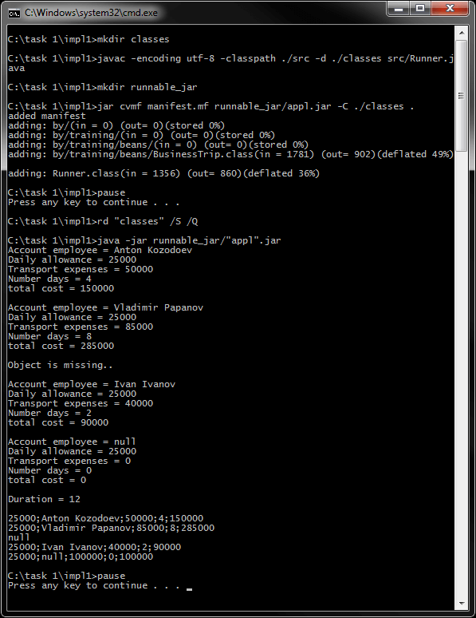
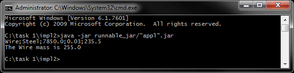
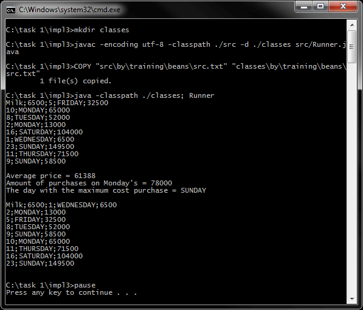
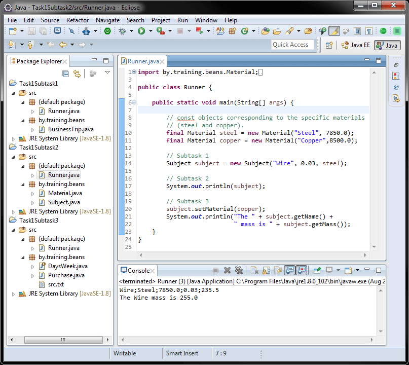

# Задание 1 - Классы
[&lt; назад](../../../)  
<!--- *Прочтите это на другом языке:* *[~~English~~](README.en.md)*, **[Русский](README.md)**.  -->
Исходный код приложений предполагает запуск в JDK 7 (и выше).  
Также приложены инструкции по импорту и запуску проектов в IDE Eclipse, IDEA и NetBeans.

## Задания
* 1.Определить класс BusinessTrip с описанием командировочных расходов сотрудника.  
*Поля класса*: суточная ставка пособия в белорусских рублях (константное), счёт сотрудника, транспортные расходы в белорусских рублях, количество дней.  
*Конструкторы*: конструктор по-умолчанию, конструктор общего назначения (универсальный конструктор).  
*Методы*: геттеры/сеттеры; **getTotal()** – расчет суммарных затрат командировки (транспортные расходы + суточная ставка пособия * количество дней); **show()** – печать всех полей в консоли (каждое поле и суммарные затраты командировки должна быть отдельной строке в следующем формате: name=value); **toString()** – преобразование объектов в строку в cvs-формате: каждое поле и суммарные затраты командировки, разделенных символом “;”.  
 Определить класс Runner в пакете по умолчанию, где:
  * Создать массив из 5 объектов (элемент с индексом 2 должен быть пустым; последний элемент массива должен быть создан конструктором по умолчанию; другие элементы должны быть созданы конструктором общего назначения).
  * Распечатать содержимое массива в консоли, используя метод show().
  * Изменить транспортные расходы работника в последнем объекте массива.
  * Распечатать общую продолжительность двух первых командировок одним оператором.
  * Распечатать содержимое массива в консоли (по одному элементу на строку), используя метод toString().

* 2.Определить класс Material, описывающий однородный материал.  
*Поля класса*: название, плотность.  
*Конструкторы*: конструктор по-умолчанию, конструктор общего назначения (универсальный конструктор).  
*Методы*: геттеры; **toString()** – преобразование объектов в строку в cvs-формате.  
Определить в том же пакете класс Subject, описывающий предмет, состоящий из однородного материала.  
*Поля класса*: название, материал, объем.  
*Конструкторы*: конструктор по-умолчанию, конструктор общего назначения (универсальный конструктор).  
*Методы*: геттеры/сеттеры; **getMass()** – вычисление массы объекта (density * volume); **toString()** – преобразование объектов в строку в cvs-формате: каждое поле разделенно символом “;”.  
Определить класс Runner в пакет по умолчанию, где:  
  * Создайть объект, представляющий стальной провод, имеющий объем 0.03 кубических метров.
  * Вывести содержимое объекта на консоль, используя метод toString().
  * Измененить материал проволоки на медь (плотность = 8500.0) и вывести эту массу.

* 3.Определить класс Purchase, с описанием оптовой закупки одного и того же товара в такой же цене в течение недели. Класс Purchase должен реализовывать интерфейс Comparable, параметризованный в этом классе.  
*Поля класса*: название товара, цена (в белорусских рублях), количество приобретенных единиц, день недели (использовать enumeration).  
*Конструкторы*: конструктор по-умолчанию, конструктор общего назначения (универсальный конструктор).  
*Методы*: геттеры/сеттеры; **getCost()** – вычисление стоимости покупки; **toString()** – преобразование объектов в строку в cvs-формате; **compareTo(Purchase purchase)** – сравнение покупкок (возвращает целое число меньше 0, равно 0, больше 0, если это количество приобретенных единиц меньше, равно, больше одной покупки соответственно).  
Определить класс Runner в пакет по умолчанию, где:  
  * Создать массив из 9-ти не пустых объектов.
  * Распечатать содержимое массива на консоль (константы 1 раз сначала).
  * Вычислить среднюю стоимость всех покупок, общую стоимость всех покупок, в понедельник, в день с максимальной стоимостью приобретения.
  * Отсортировать массив по номеру поля в возрастающем порядке, используя метод sort() класса Arrays.
  * Распечатать содержимое массива на консоль (константы 1 раз сначала).
  * Бонус: добавить в класс Purchase, в блоке статической инициализации, загрузку покупки из файла.

## Компиляция и запуск приложения в CMD:
Для запуска приложения в ОС требуется установленная JDK версии 7 или выше.  
В переменных окружения ОС должны быть прописаны пути к JDK (Для компиляции и запуска из CMD).
* 1. Для компиляции java-файлов в class-файлы в *cmd*:  
`javac -encoding utf-8 -classpath ./src -d ./src src/Runner.java`
* 2. Далее, запуск class-файлов:  
`java -classpath ./src; Runner`

Для упрощения ввода вышеперечисленных команд в *cmd*, в корне каталогов с проектами находятся скрипты *compile and run.bat*.

## Импорт и запуск проекта в IDE
* **Eclipse**.
  * 1. Создать новый Java SE проект: *File &rarr; New &rarr; Java Project*.
  * 2. Импортировать исходники в созданный проект: *File &rarr; Import &rarr; General &rarr; File System*.  
  Требуется указать каталог *src* и проигнорировать файл манифеста и батник.

* **NetBeans**.  
Создать новый Java проект из существующих исходников:  
*File &rarr; New Project &rarr; Java &rarr; Java Project With Exiting Sources*  
Затем нужно указать путь в каталог *src* проекта: *Exiting Sources &rarr; Source Package Folders &rarr; Add Folder*.  
Эта IDE не корректно распознаёт структуру каталогов, и может сделать корневым пакетом *src*, поэтому указывать нужно именно на java-файлы **внутри** *src*.

* **IntelliJ IDEA**.  
Импорт проекта - при запуске IDE:  
*Import Project &rarr; Указать путь к проекту &rarr; Create project from exiting sources*.

## Демонстрационные скриншоты:

  
  
  

