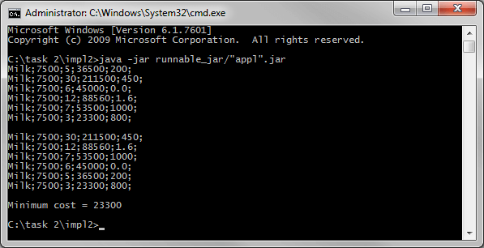

# Задание 2 - Наследование
[&lt; назад](../../../)  
<!--- *Прочтите это на другом языке:* *[~~English~~](README.en.md)*, **[Русский](README.md)**.  -->
Исходный код приложений предполагает запуск в JDK 7 (и выше).  
Также приложены инструкции по импорту и запуску проектов в IDE Eclipse, IDEA и NetBeans.

## Задания
1.Определить суперкласс Purchase, с описанием покупки товара.  
*Поля суперкласса*: название товара, цена в белорусских рублях, количество купленных единиц.  
*Конструкторы*: конструктор по-умолчанию, конструктор общего назначения (универсальный конструктор).  
*Методы*: геттеры/сеттеры; **getCost()** – расчет стоимости покупки; **toString()** – преобразование объекта в строку в следующем формате: каждое поле и стоимость покупки, разделенные символом «;»); **equals()** – сравнение покупки (равные, если имя и цена одинаковые).  

 Определить 1-ый подкласс покупки со скидкой и переопределите необходимые методы.  
Определить 2-ой подкласс для покупки со скидкой, который будет представлен, если количество приобретенных единиц больше, чем заданная подклассе константа. Ставка дисконтирования определяется в процентах от стоимости покупки. Переопределить необходимые методы.  
Файл src\in.txt состоит из 6 строк с корректными данными. Каждая строка содержит необходимых данных, разделенных пробелами, для 1 объекта суперкласса или первого подкласса или второго. Каждая строка состоит из некоторого идентификатора класса покупки, следом идут остальные данные.  

Определить класс Runner в пакете по умолчанию (подзадачи 2-5 в одном цикле), где:
  * Создать массив на 6 объектов.
  * Считайте данные из фала в массив.
  * Распечатать содержимое массива на консоль (один элемент в строке).
  * Распечатать покупку с максимальной стоимостью.
  * Определить, являются ли все покупки равны.  

2.Определить класс Commodity, описывающий товар.  
*Поля класса*: название, цена в белорусских рублях.  
*Конструкторы*: конструктор по-умолчанию, конструктор общего назначения (универсальный конструктор).  
*Методы*: геттеры; **toString()** – преобразование объектов в строку в cvs-формате (разделитель ";").  
Определить суперкласс AbstractPurchase, с описанием покупка товара и реализацией интерфейса Comparable&lt;AbstractPurchase&gt;.  
*Поля класса*: товар, количество купленных единиц.  
*Конструкторы*: конструктор по-умолчанию, конструктор общего назначения (универсальный конструктор).  
*Методы*: геттеры/сеттеры; **getCost()** – абстрактный метод; **toString()** – преобразование из объекта в строку в csv-формате: каждое поле и стоимость покупки, разделенные символом «;»; compareTo(AbstractPurchase purchase) – сравнение покупок по убыванию стоимости.  

 Определить первый подкласс для покупки со скидкой цены и переопределить необходимые методы.   
Определить второ1 подкласс для покупки со скидкой, которая будет предоставлена, если количество приобретаемых единиц больше заданной в подклассе константы. Ставка дисконтирования определяется в процентах от стоимости покупки. Переопределить необходимые методы.  
Определить третий подкласс для покупки с добавлением транспортных расходов и переопределить необходимые методы.

 Определить класс Runner в пакет по умолчанию, где:  
  * Создать уникальный товар для покупки.
  * Создайть массив из 6-ти объектов (2 – каждого подкласса).
  * Распечатать содержимое массива на консоль (один элемент в строке).
  * Отсортировать массив по стоимости в порядке убывания, используя метод sort() класса Arrays.
  * Распечатать содержимое массива на консоль (один элемент в строке).
  * Распечатать минимальную стоимость покупки.

## Компиляция и запуск приложения в CMD:
Для запуска приложения в ОС требуется установленная JDK версии 7 или выше.  
В переменных окружения ОС должны быть прописаны пути к JDK (Для компиляции и запуска из CMD).
* 1. Для компиляции java-файлов в class-файлы в *cmd*:  
`javac -encoding utf-8 -classpath ./src -d ./src src/Runner.java`
* 2. Далее, запуск class-файлов:  
`java -classpath ./src; Runner`

Для упрощения ввода вышеперечисленных команд в *cmd*, в корне каталогов с проектами находятся скрипты *compile and run.bat*.

## Импорт и запуск проекта в IDE
* **Eclipse**.
  * 1. Создать новый Java SE проект: *File &rarr; New &rarr; Java Project*.
  * 2. Импортировать исходники в созданный проект: *File &rarr; Import &rarr; General &rarr; File System*.  
  Требуется указать каталог *src* и проигнорировать файл манифеста и батник.

* **NetBeans**.  
Создать новый Java проект из существующих исходников:  
*File &rarr; New Project &rarr; Java &rarr; Java Project With Exiting Sources*  
Затем нужно указать путь в каталог *src* проекта: *Exiting Sources &rarr; Source Package Folders &rarr; Add Folder*.  
Эта IDE не корректно распознаёт структуру каталогов, и может сделать корневым пакетом *src*, поэтому указывать нужно именно на java-файлы **внутри** *src*.

* **IntelliJ IDEA**.  
Импорт проекта - при запуске IDE:  
*Import Project &rarr; Указать путь к проекту &rarr; Create project from exiting sources*.

## Демонстрационные скриншоты:

  
  

