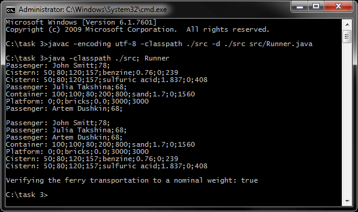
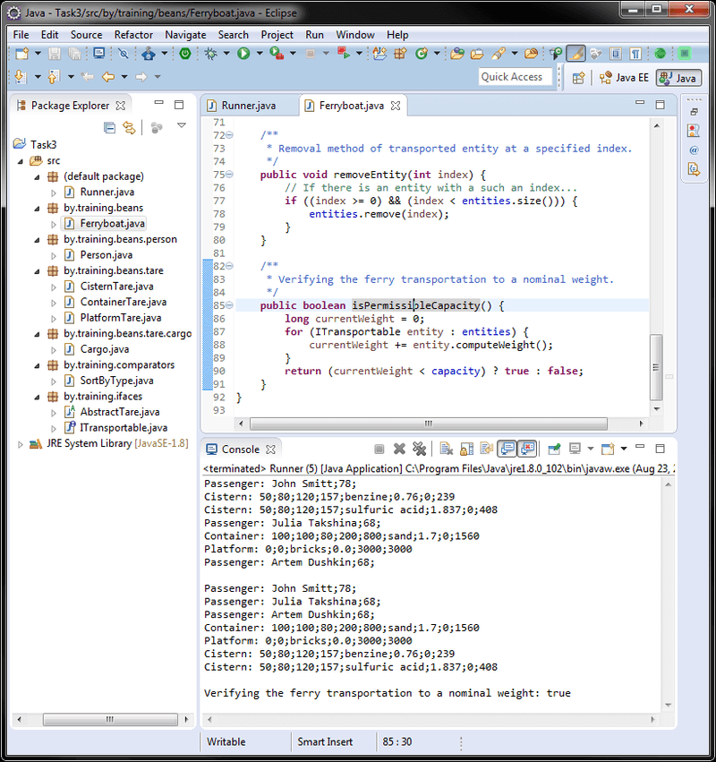
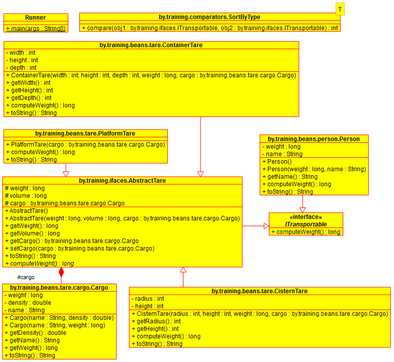

# Задание 3 - ООП
[&lt; назад](../../../)  
<!--- *Прочтите это на другом языке:* *[~~English~~](README.en.md)*, **[Русский](README.md)**.  -->
Исходный код приложений предполагает запуск в JDK 7 (и выше).  
Также приложены инструкции по импорту и запуску проектов в IDE Eclipse, IDEA и NetBeans.

## Задание
У предпринимателя имеется паром, который перевозит грузы и людей.  
Поля для класса Паром: грузоподъемность и общий массив для грузов и людей.  
Виды транспортировки грузов: 
 * прямоугольные контейнеры для однородного твердого материала (масса на основе плотности материала, параметров контейнера и массы самого контейнера);
 * платформы для любого груза (масса на основе массы груза; платформа является частью парома, т.е. ее масса принимается равной 0);
 * цилиндрические цистерны для жидкости (масса на основе плотности жидкости, параметров цистерны и массы самой цистерны).

Подзадачи:
* Спроектировать объектную модель. 
* В раннере создать необходимые объекты (ничего не вводить, использовать вызовы конструкторов с константными значениями).
* Вывести содержимое общего массива.
* Отсортировать содержимое массива по людям и видам транспортировки грузам (сначала люди, затем грузы в контейнерах, на платформах, в цистернах).
* Вывести содержимое общего массива.
* Определить, может ли перевезти паром заданные грузы и людей.
Ограничение: не делать общей иерархии классов для людей и грузов (это не логично). Подсказка: данные классы должны реализовывать одинаковый интерфейс, через которые их можно объединить в массив

## Компиляция и запуск приложения в CMD:
Для запуска приложения в ОС требуется установленная JDK версии 7 или выше.  
В переменных окружения ОС должны быть прописаны пути к JDK (Для компиляции и запуска из CMD).
* 1. Для компиляции java-файлов в class-файлы в *cmd*:  
`javac -encoding utf-8 -classpath ./src -d ./src src/Runner.java`
* 2. Далее, запуск class-файлов:  
`java -classpath ./src; Runner`

Для упрощения ввода вышеперечисленных команд в *cmd*, в корне каталогов с проектами находятся скрипты *compile and run.bat*.

## Импорт и запуск проекта в IDE
* **Eclipse**.
  * 1. Создать новый Java SE проект: *File &rarr; New &rarr; Java Project*.
  * 2. Импортировать исходники в созданный проект: *File &rarr; Import &rarr; General &rarr; File System*.  
  Требуется указать каталог *src* и проигнорировать файл манифеста и батник.

* **NetBeans**.  
Создать новый Java проект из существующих исходников:  
*File &rarr; New Project &rarr; Java &rarr; Java Project With Exiting Sources*  
Затем нужно указать путь в каталог *src* проекта: *Exiting Sources &rarr; Source Package Folders &rarr; Add Folder*.  
Эта IDE не корректно распознаёт структуру каталогов, и может сделать корневым пакетом *src*, поэтому указывать нужно именно на java-файлы **внутри** *src*.

* **IntelliJ IDEA**.  
Импорт проекта - при запуске IDE:  
*Import Project &rarr; Указать путь к проекту &rarr; Create project from exiting sources*.

## Демонстрационные скриншоты:

  
  

