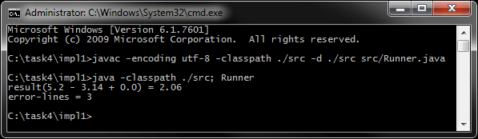
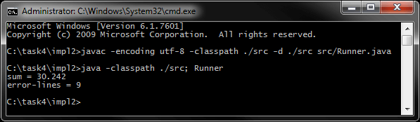
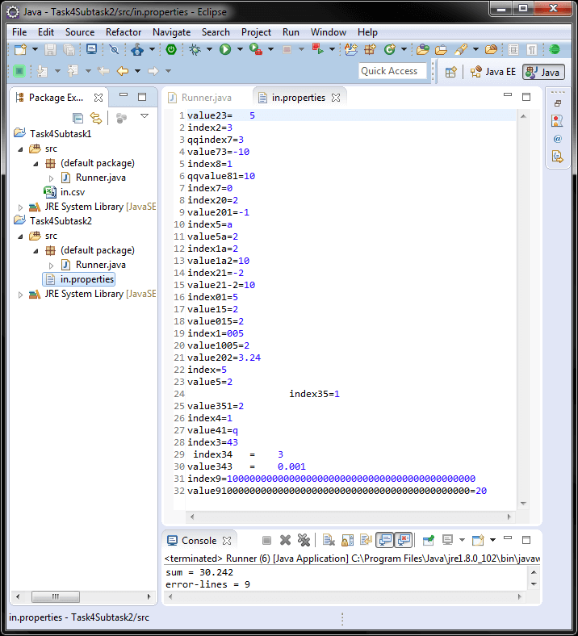

# Задание 4 - Строки
[&lt; назад](../../../)  
<!--- *Прочтите это на другом языке:* *[~~English~~](README.en.md)*, **[Русский](README.md)**.  -->
Исходный код приложений предполагает запуск в JDK 7 (и выше).  
Также приложены инструкции по импорту и запуску проектов в IDE Eclipse, IDEA и NetBeans.

## Задания
* 1.Файл *in.csv* (текстовые данные через точку с запятой) содержит последовательность строк с любым количеством элементов в каждой строке.  
Значение нулевого элемента определяет индекс элемента, с которым нужно будет работать.
  * Вычислить сумму элементов, определяемых нулевыми элементами. Создайте строку с результатом и распечатайте её.
  * Вывести количество строк с «ошибками».  
 
 Не использовать регулярные выражения и replaceAll().  
 Пример:
<pre>
------------------                  -----------------------------------
| in.csv         |                  |             Вывод               |
------------------                  -----------------------------------
| 3;qw;4;5.2;2.7 |                  |                                 |
| 15;;;k;5       |                  |                                 |
| 1;-3.14;fgh;5  |        =&gt;        | result(5.2 - 3.14 + 0.0) = 2.06 |
| 0;;e1;2;3      |                  | error-lines = 3                 |
| -2.3;a;b;c     |                  |                                 |
| b;d;e          |                  |                                 |
------------------                  -----------------------------------
</pre>
* 2.Файл *in.properties* (пары key=value) содержит некоторую последовательность строк. 
Пусть элемент с ключом index*i* имеет значение j (i=1..n, j=1..m – натуральные числа без ведущих нулей). Он определяет ключевой элемент с именем valueij (indexi = j), с которым нужно работать. 
  * Вывести сумму значений элементов, имеющих ключ valueij (смотрите примеры ниже).
  * Выведите количество индексных элементов с "ошибками" (i, j – не натуральные числа; не правильное значение - элемент для правильного элемента индекса)

 При чтении значения valueij по ключу indexi началом значения valueij является первый непробельный символ. Следовательно, в начале значения valueij не могут оказаться пробелы. С другой стороны, завершающие пробельные символы являются частью значения valueij  
 Пример:
<pre>
------------------                  -------------------
| in.properties  |                  |      Вывод      |
------------------                  -------------------
| index1 = 3     |                  |                 |
| value11=qw     |                  |                 |
| value12=4      |                  |                 |
| value13 = 5.1  | &lt;- val           |                 |
| value14=2.7    |                  |                 |
| index2=15      | &lt;- err           |                 |
| value21=       |                  |                 |
| value22=       |                  |                 |
| value23=       |                  |                 |
| value24=k      |                  |                 |
| value25=5      |        =&gt;        | sum = 8.24      |
| index3=1       |                  | error-lines = 3 |
| value31=  3.14 | &lt;- val           |                 |
| value32=fgh    |                  |                 |
| value33=5      |                  |                 |
| index4=0       | &lt;- err           |                 |
| value41=       |                  |                 |
| value42=e1     |                  |                 |
| value43=2      |                  |                 |
| value44=3      |                  |                 |
| index5=b       | &lt;- err           |                 |
| value51=d      |                  |                 |
| value52=e      |                  |                 |
------------------                  -------------------
</pre>

## Компиляция и запуск приложения в CMD:
Для запуска приложения в ОС требуется установленная JDK версии 7 или выше.  
В переменных окружения ОС должны быть прописаны пути к JDK (Для компиляции и запуска из CMD).
* 1. Для компиляции java-файлов в class-файлы в *cmd*:  
`javac -encoding utf-8 -classpath ./src -d ./src src/Runner.java`
* 2. Далее, запуск class-файлов:  
`java -classpath ./src; Runner`

Для упрощения ввода вышеперечисленных команд в *cmd*, в корне каталогов с проектами находятся скрипты *compile and run.bat*.

## Импорт и запуск проекта в IDE
* **Eclipse**.
  * 1. Создать новый Java SE проект: *File &rarr; New &rarr; Java Project*.
  * 2. Импортировать исходники в созданный проект: *File &rarr; Import &rarr; General &rarr; File System*.  
  Требуется указать каталог *src* и проигнорировать файл манифеста и батник.

* **NetBeans**.  
Создать новый Java проект из существующих исходников:  
*File &rarr; New Project &rarr; Java &rarr; Java Project With Exiting Sources*  
Затем нужно указать путь в каталог *src* проекта: *Exiting Sources &rarr; Source Package Folders &rarr; Add Folder*.  
Эта IDE не корректно распознаёт структуру каталогов, и может сделать корневым пакетом *src*, поэтому указывать нужно именно на java-файлы **внутри** *src*.

* **IntelliJ IDEA**.  
Импорт проекта - при запуске IDE:  
*Import Project &rarr; Указать путь к проекту &rarr; Create project from exiting sources*.

## Демонстрационные скриншоты:

  
  

