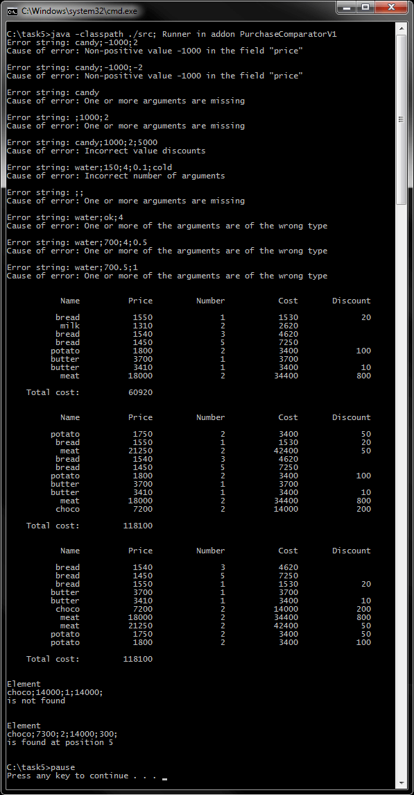
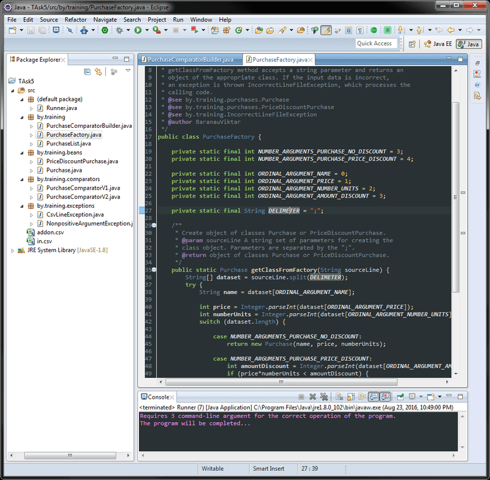

# Задание 5 - Коллекции (фабрика, компараторы)
[&lt; назад](../../../)  
<!--- *Прочтите это на другом языке:* *[~~English~~](README.en.md)*, **[Русский](README.md)**.  -->
Исходный код приложений предполагает запуск в JDK 7 (и выше).  
Также приложены инструкции по импорту и запуску проектов в IDE Eclipse, IDEA и NetBeans.

## Задание
Определите класс PurchasesList  для коллекции объектов двух типов (из задания 2 - наследование, подзадача 1):  
 – суперкласс, описывающий покупку товара Purchase;  
 – подкласс для покупки со скидкой PriceDiscountPurchase.

Файл в csv-формате, представляет собой последовательность строк текста. Каждая строка содержит набор значений, разделенных точкой с запятой и соответствует одному из объектов суперкласса или подкласса в зависимости от количества параметров в строке. Строки с неправильным содержимым должны быть пропущены. 
Все имена файлов в программе должны быть использованы без csv–расширения и предшествующего пути src/ (добавить по-умолчанию).  
Конструкторы:  
 – конструктор по-умолчанию для создания пустой коллекции,
 – конструктор с параметом – имя csv-файла, загружающий элементы в коллекцию из csv–файла. Возвращать пустую коллекцию, если возникли проблемы с csv-файлом в процессе обработки.
Необходимое поле класса – это сама коллекция. Кроме того, другие поля класса должны быть тоже включены в класс.  
Реализовать следующие операции c коллекцией, то есть с полем класса:  
 – вставка покупки в коллекцию по индексу (если значение индекса некорректное, следует вставить объект в конец коллекции);  
 – удаление элемента по его индексу;  
 – расчет общей стоимости всех покупок;  
 – печать коллекции в табличной форме и общей стоимости всех покупок;  
 – сортировка коллекции по заданному критерию, используя метод sort() класса Collections;  
 – поиск элемента в коллекции по тем же критериям, используя метод binarySearch() класса Collections.  

Критерий сортировки:  
 1. Сравнение по возрастанию строковых полей;  
 2. Если два строковых значения равны, объект суперкласса меньше подкласса;  
 3. Если объекты принадлежат одному и тому же классу, то по увеличению стоимости покупки.

Реализовать две версии критериев:  
 1. Не используя рефлексию в классе компаратора, то есть нужно использовать операцию instanceof;  
 2. Используя рефлексию, вызывая метод getClass() из сравниваемых объектов.

Определить класс Runner в пакет по-умолчанию. Метод main() должен получать 3 аргумента из командной строки:  
 1. Название основного файла в формате csv;  
 2. Название дополнительного файла в формате csv;  
 3. Название класса версии компаратора.   
Основной файл может содержать некорректные строки, которые нужно пропустить.  
Дополнительный файл считается правильным и содержит точно 5 строк.

Алгоритм метода main():
 * создайть объект разработанного класса и загрузить в него элементы коллекции из основного файла;
 * вывести коллекцию;
 * создайть еще один объект разработанного класса и загрузить в него элементы коллекции из дополнительного файла;
 * вставить последний элемент второй коллекции в позиции 0 первой коллекции;
 * вставить первый элемент второй коллекции в позицию 1000 первой коллекции;
 * вставить элемент второй коллекции с индексом 2, в позицию 2 первой коллекции;
 * попробовать удалить элементы с индексами 3, 10 и –5;
 * вывести первую коллекцию;
 * сортировать первую коллекцию; 
 * вывести первую коллекцию; 
 * найти элемент с индексом 1 и элемент с индексом 3 второй коллекции в первой коллекции и распечатать полученные результаты.

Пример аргументов командной строки:  
`in addon PurchaseComparatorV1`

## Компиляция и запуск приложения в CMD:
Для запуска приложения в ОС требуется установленная JDK версии 7 или выше.  
В переменных окружения ОС должны быть прописаны пути к JDK (Для компиляции и запуска из CMD).
* 1. Для компиляции java-файлов в class-файлы в *cmd*:  
`javac -encoding utf-8 -classpath ./src -d ./src src/Runner.java`
* 2. Далее, запуск class-файлов:  
`java -classpath ./src; Runner in addon PurchaseComparatorV1`

Для упрощения ввода вышеперечисленных команд в *cmd*, в корне каталога с проектом находится скрипт *compile and run.bat*.

## Импорт и запуск проекта в IDE
* **Eclipse**.
  * 1. Создать новый Java SE проект: *File &rarr; New &rarr; Java Project*.
  * 2. Импортировать исходники в созданный проект: *File &rarr; Import &rarr; General &rarr; File System*.  
  Требуется указать каталог *src* и проигнорировать файл манифеста и батник.

* **NetBeans**.  
Создать новый Java проект из существующих исходников:  
*File &rarr; New Project &rarr; Java &rarr; Java Project With Exiting Sources*  
Затем нужно указать путь в каталог *src* проекта: *Exiting Sources &rarr; Source Package Folders &rarr; Add Folder*.  
Эта IDE не корректно распознаёт структуру каталогов, и может сделать корневым пакетом *src*, поэтому указывать нужно именно на java-файлы **внутри** *src*.

* **IntelliJ IDEA**.  
Импорт проекта - при запуске IDE:  
*Import Project &rarr; Указать путь к проекту &rarr; Create project from exiting sources*.

## Демонстрационные скриншоты:

  

