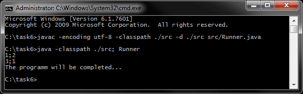

# Задание 6 - Коллекции (regex, компараторы)
[&lt; назад](../../../)  
<!--- *Прочтите это на другом языке:* *[~~English~~](README.en.md)*, **[Русский](README.md)**.  -->
Исходный код приложений предполагает запуск в JDK 7 (и выше).  
Также приложены инструкции по импорту и запуску проектов в IDE Eclipse, IDEA и NetBeans.

## Задание
Файл in.txt содержит корректные координаты отрезков(сегметнов) (по одному в строке) в формате:  
    *(x1;y1) (x2;y2)*
 * 1. Сформировать список вида (len; num), где  
 len - длина сегмента(отрезка), округленное до целого числа;  
 num - количество сегментов длиной len. 
 * 2. Сортировать список по полю num в порядке убывания.

Пример:
<pre>
 ------------------------------------------------                 ---------
 |                   in.txt                     |                 | Вывод |
 ------------------------------------------------                 ---------
 |         (0.  ;   0)    (  2.5;   0.0)        |        =&gt;       | 1;2   |
 |   (         0;0.99953)    (  0;   2        ) |                 | 3;1   |
 |(-3.0f; 20.1e-1)     (-2;2)                   |                 |       |
 ------------------------------------------------                 ---------
</pre>
Длина отрезка: sqrt((x1 – x2)2 + (y1 – y2)2)  
Разрешается использовать коллекции, реализующие любой интерфейс, производный от Collection.  
Цикл с линейным поиском элемента запрещается.

## Компиляция и запуск приложения в CMD:
Для запуска приложения в ОС требуется установленная JDK версии 7 или выше.  
В переменных окружения ОС должны быть прописаны пути к JDK (Для компиляции и запуска из CMD).
* 1. Для компиляции java-файлов в class-файлы в *cmd*:  
`javac -encoding utf-8 -classpath ./src -d ./src src/Runner.java`
* 2. Далее, запуск class-файлов:  
`java -classpath ./src; Runner in addon PurchaseComparatorV1`

Для упрощения ввода вышеперечисленных команд в *cmd*, в корне каталога с проектом находится скрипт *compile and run.bat*.

## Импорт и запуск проекта в IDE
* **Eclipse**.
  * 1. Создать новый Java SE проект: *File &rarr; New &rarr; Java Project*.
  * 2. Импортировать исходники в созданный проект: *File &rarr; Import &rarr; General &rarr; File System*.  
  Требуется указать каталог *src* и проигнорировать файл манифеста и батник.

* **NetBeans**.  
Создать новый Java проект из существующих исходников:  
*File &rarr; New Project &rarr; Java &rarr; Java Project With Exiting Sources*  
Затем нужно указать путь в каталог *src* проекта: *Exiting Sources &rarr; Source Package Folders &rarr; Add Folder*.  
Эта IDE не корректно распознаёт структуру каталогов, и может сделать корневым пакетом *src*, поэтому указывать нужно именно на java-файлы **внутри** *src*.

* **IntelliJ IDEA**.  
Импорт проекта - при запуске IDE:  
*Import Project &rarr; Указать путь к проекту &rarr; Create project from exiting sources*.

## Демонстрационные скриншоты:

  

