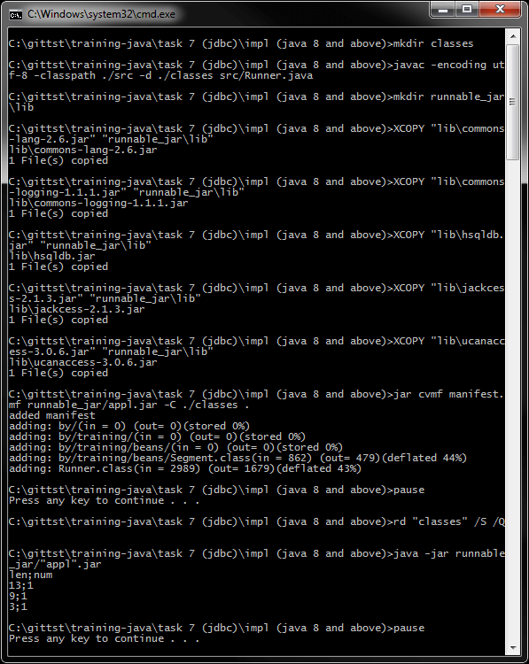
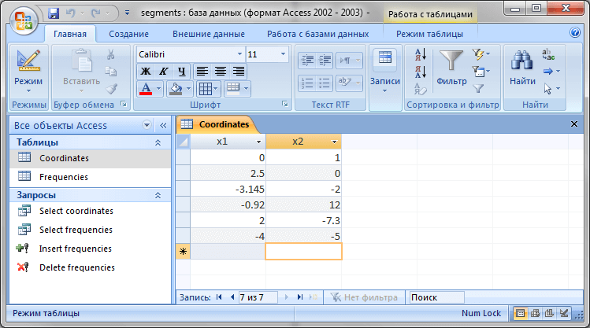
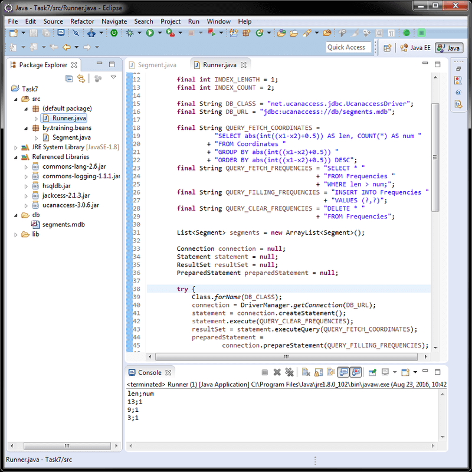

# Задание 7 - JDBC (ms access, prepared statement)
[&lt; назад](../../../)  
<!--- *Прочтите это на другом языке:* *[~~English~~](README.en.md)*, **[Русский](README.md)**.  -->
Исходный код приложения предполагает запуск в JDK 7 (и выше).

## Задание
Таблица базы данных *Coordinates* содержит координаты отрезков x1 и x2 на линии.  
 * 1. Используя SQL запрос, создать отсортированный список вида (len; num), где *len* – это длина сегмента, округлённая до целого числа и *num* - это количество сегментов длиной len (сортировать по возрастанию поля len).
 * 2. Сохранить список в таблице базы данных *Frequencies*, предварительно очистив таблицу от старого содержимого.
 * 3. Используя SQL запрос, найти записи, где *len* больше чем *num*.  
Пример таблицы *Coordinates* и вывода:  
<pre>
 -------------------              -------------------
 |   x1   |   x2   |              |   len  |   num  |
 -------------------              -------------------
 |    0   |    1   |      =>      |    1   |    2   |
 |  2,5   |    0   |              |    3   |    1   |
 | -3,145 |   -2   |              |    3   |    1   |
 -------------------              -------------------
</pre>

## Описание приложений
Представлены 2 версии решений заданий для Java 7 и Java 8 и выше.  
В **Java 8** из виртуальной машины был [удалён](https://stackoverflow.com/questions/22984438/java-lang-classnotfoundexception-sun-jdbc-odbc-jdbcodbcdriver-exception-occurin) драйвер **sun.jdbc.odbc.JdbcOdbcDriver** для создания ODBC-моста к базе данных, поэтому используется опенсорсный драйвер [UCanAccess 3.0.6](http://ucanaccess.sourceforge.net/site.html). Он не требует регистрации базы данных в ODBC и использует относительную ссылку к файлу бд в файловой системе.  
В случае запуска проекта на **Java 7** требуется предварительное развёртывание базы в **ODBC Data Source Administrator** (Описано для x86 и x64 в соответсвующем разделе).  
Для базы данных представлены скрипт создания таблиц и скрипт с запросами приложения (в каталоге *db-scripts*).

## Развёртывание MS Access в ODBC (для Java 7 и ниже)
Есть 2 пути развёртывания - использовать консольное приложение **odbcconf.exe** или окнонное приложение ODBC Data Source Administrator **odbcad32.exe**.
 * Для x86-системы.
  - Оконное приложение: можно запустить через *Control panel &rarr; Adminstrative Tools &rarr; Data Sources (ODBC)* или *Win+R &rarr; odbcad32.exe*. Далее нужно выбрать Microsoft Access Driver (mdb), выбрать файл segments.mdb и указать алиас segments.
  - Консольное приложение: из корня проекта запустить в cmd:  
   `odbcconf.exe CONFIGDSN ^ "Microsoft Access Driver (*.mdb)" ^ "DSN=segments;DBQ=%cd%\segments.mdb"`
 * Для x64-системы указанный выше способ потребуется немного изменить, так как в x64-системах Windows из cmd и панели управления запускаются неверные версии приложений.
  - Оконное приложение: можно запустить по адресу *%systemdrive%\Windows\syswow64\odbcad32.exe*. Далее нужно выбрать Microsoft Access Driver (mdb), выбрать файл segments.mdb и указать алиас segments.
  - Консольное приложение: из корня проекта запустить в cmd:  
   `%systemdrive%\Windows\syswow64\odbcconf.exe CONFIGDSN ^ "Microsoft Access Driver (*.mdb)" ^ "DSN=segments;DBQ=%cd%\segments.mdb"`  

Для упрощения развёртывания базы данных, в корне проекта расположен скрипт *odbc_db_deploy.bat*, который корректно определяет битность ОС и запускает верную версию odbcconf.exe (консольный вариант).  
Также, для удобства, в корне проекта находится скрипт *odbc_db_undeploy (manual).bat*, который запускает корректную версию (x86 или x64) окнонного приложения odbcad32.exe (для удобства удаления алиаса бд).

## Компиляция и запуск приложения в CMD:
Для запуска приложения в ОС требуется установленная JDK версии 7 или выше.  
В переменных окружения ОС должны быть прописаны пути к JDK (Для компиляции и запуска из CMD).  
В случае запуска версии для Java 7, должен быть развёрнут ODBC-мост в MS Access базе данных.  
В корне каталогов с проектами находятся скрипты *compile and run.bat* для компиляции различных версий приложений, сборки запускаемых jar и запуска приложений. В случае, если нужен только запуск, без сборки jar, нужно раскоментировать соответсвуещие строки (отмечены коментариями).

## Демонстрационные скриншоты:

  
  
