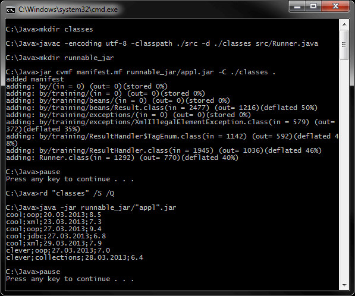
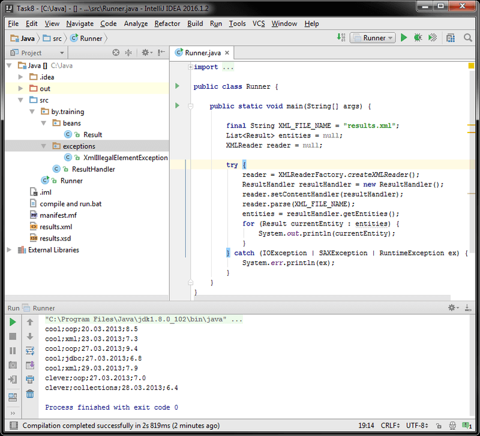
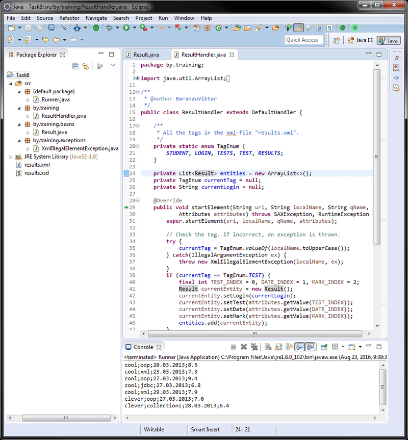

# Задание 8 - XML (SAX-парсер, XSD-схема)
[&lt; назад](../../../)  
<!--- *Прочтите это на другом языке:* *[~~English~~](README.en.md)*, **[Русский](README.md)**.  -->
Исходный код приложения предполагает запуск в JDK 7 (и выше).  
Также приложены инструкции по импорту и запуску системы в IDE Eclipse, IDEA и NetBeans.

## Задание
Корректный файл results.xml содержит результаты тестов студентов, и имеет следующую структуру:
```xml
<?xml version="1.0" encoding="UTF-8"?>
<results xmlns:xsi="http://www.w3.org/2001/XMLSchema-instance" xsi:noNamespaceSchemaLocation="results.xsd">
    <student>
        <login>cool</login>
        <tests>
            <test name="oop" date="2013-03-20" mark="8.5"/>
            <test name="xml" date="2013-03-23" mark="7.3"/>
            <test name="oop" date="2013-03-27" mark="9.4"/>
            <test name="jdbc" date="2013-03-27" mark="6.8"/>
            <test name="xml" date="2013-03-29" mark="7.9"/>
        </tests>
    </student>
    <student>
        <login>clever</login>
        <tests>
            <test name="oop" date="2013-03-27" mark="7.0"/>
            <test name="collections" date="2013-03-28" mark="6.4"/>
        </tests>
      </student>
</results>
```
 * 1. Создайте XSD–схему для указанного XML–файла.
 * 2. Используя SAX парсер, загружать данные из файла results.xml в коллекцию ArrayList<Result>. Класс Result должен содержать следующие поля: String login, String test, Date date, int mark.
 * 3. Распечатать коллекцию в формате: login;test;date;mark.

## Компиляция и запуск приложения в CMD:
Для запуска приложения в ОС требуется установленная JDK версии 7 или выше.  
В переменных окружения ОС должны быть прописаны пути к JDK (Для компиляции и запуска из CMD).
* 1. Для компиляции java-файлов в class-файлы в *cmd*:  
`javac -encoding utf-8 -classpath ./src -d ./src src/Runner.java`
* 2. Далее, для запуска, есть 2 пути: запуск скомпилированных class-файлов "как есть", либо предварительная сборка class-файлов в "запускаемый" jar-архив и запуск через него.
  * 2.1. *Запуск class-файлов "как есть"*: для этого в *cmd* нужно воспользоваться командой:  
  `java -classpath ./src; Runner`
  * 2.2. *Сборка запускаемого jar*:  
    * 2.2.1. Упаковка jar-файла осуществляется коммандой:  
    `jar cvmf manifest.mf filename.jar -C ./src .`
    * 2.2.2. Запуск созданного jar-файла осуществляется коммандой:  
    `java -jar "filename".jar`

Для упрощения ввода вышеперечисленных команд в *cmd*, в корне каталога с проектом находится<br>скрипт *compile and run.bat*.

## Импорт и запуск проекта в IDE
* **Eclipse**.
  * 1. Создать новый Java SE проект: *File &rarr; New &rarr; Java Project*.
  * 2. Импортировать исходники в созданный проект: *File &rarr; Import &rarr; General &rarr; File System*.  
  Требуется указать каталог *src*, файлы xml/xsd и проигнорировать файл манифеста и батник.

* **NetBeans**.  
Создать новый Java проект из существующих исходников:  
*File &rarr; New Project &rarr; Java &rarr; Java Project With Exiting Sources*  
Затем нужно указать путь в каталог *src* проекта: *Exiting Sources &rarr; Source Package Folders &rarr; Add Folder*.  
Эта IDE не корректно распознаёт структуру каталогов, и может сделать корневым пакетом *src*, поэтому указывать нужно именно на java-файлы **внутри** *src*.

* **IntelliJ IDEA**.  
Импорт проекта - при запуске IDE:  
*Import Project &rarr; Указать путь к проекту &rarr; Create project from exiting sources*.

## Демонстрационные скриншоты:

  
  

