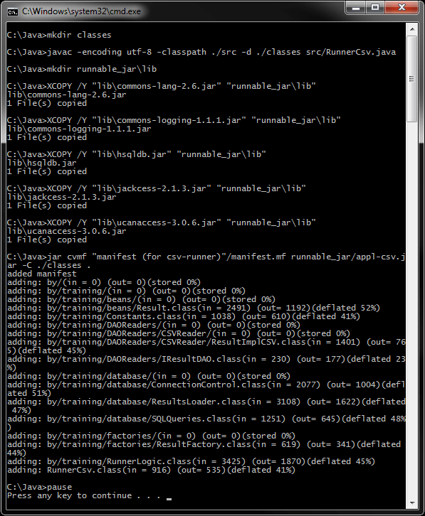
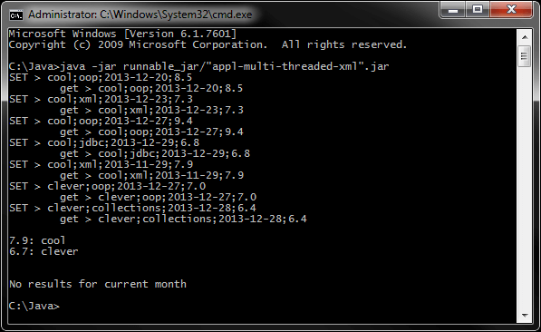
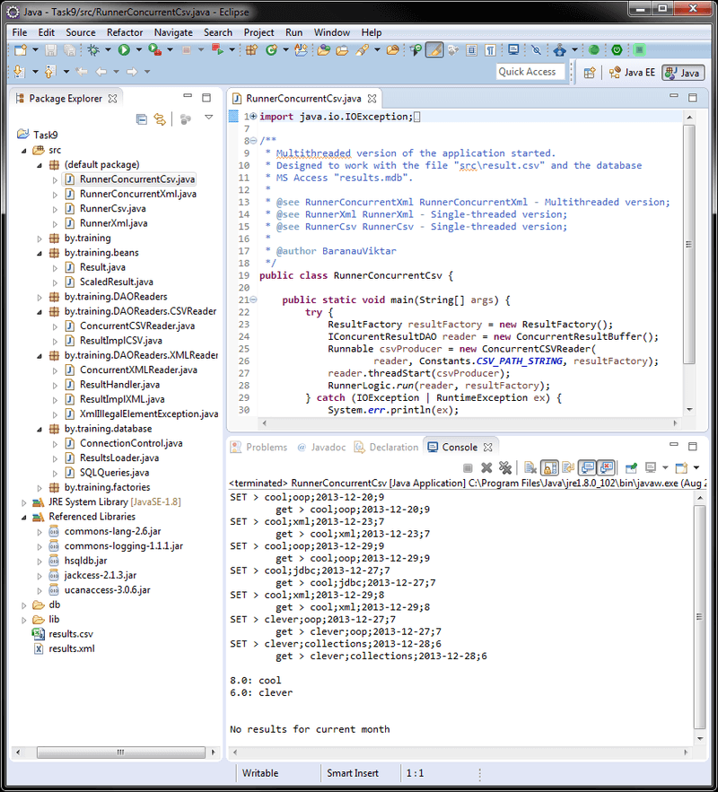

# Задание 9 - Java SE (финальное)<br>(csv, xml, jdbc, ms access, многопоточность)
[&lt; назад](../../../)  
<!--- *Прочтите это на другом языке:* *[~~English~~](README.en.md)*, **[Русский](README.md)**.  -->
Исходный код приложений предполагает запуск в JDK 7 (и выше).
* [Задания](#%D0%97%D0%B0%D0%B4%D0%B0%D0%BD%D0%B8%D1%8F)
* [Описание приложений](#%D0%9E%D0%BF%D0%B8%D1%81%D0%B0%D0%BD%D0%B8%D0%B5-%D0%BF%D1%80%D0%B8%D0%BB%D0%BE%D0%B6%D0%B5%D0%BD%D0%B8%D0%B9)
* [Развёртывание MS Access в ODBC (для Java 7 и ниже)](#%D0%A0%D0%B0%D0%B7%D0%B2%D1%91%D1%80%D1%82%D1%8B%D0%B2%D0%B0%D0%BD%D0%B8%D0%B5-ms-access-%D0%B2-odbc-%D0%B4%D0%BB%D1%8F-java-7-%D0%B8-%D0%BD%D0%B8%D0%B6%D0%B5)
* [Компиляция и запуск приложения в CMD](#%D0%9A%D0%BE%D0%BC%D0%BF%D0%B8%D0%BB%D1%8F%D1%86%D0%B8%D1%8F-%D0%B8-%D0%B7%D0%B0%D0%BF%D1%83%D1%81%D0%BA-%D0%BF%D1%80%D0%B8%D0%BB%D0%BE%D0%B6%D0%B5%D0%BD%D0%B8%D1%8F-%D0%B2-cmd)
* [Демонстрационные скриншоты](#%D0%94%D0%B5%D0%BC%D0%BE%D0%BD%D1%81%D1%82%D1%80%D0%B0%D1%86%D0%B8%D0%BE%D0%BD%D0%BD%D1%8B%D0%B5-%D1%81%D0%BA%D1%80%D0%B8%D0%BD%D1%88%D0%BE%D1%82%D1%8B)

## Задания
 * Версия 1 - **однопоточная**:
   * 1. Файл *results.csv* содержит корректные результаты тестов, пройденных студентами, и имеет следующую структуру: **student;test;date;mark** (mark – это целое число от 1 до 10).  
    - создать нормализованную базу данных для указанной структуры.  
    - загрузить данные из файла results.csv в базу данных.  
    - распечатать среднюю оценку для каждого студента, в порядке убывания этой оценки.  
    - создать и распечатать коллекцию для текущего месяца, сортированную по возрастанию даты.  
    - распечатать результаты тестов в самый поздний день текущего месяца, когда сдавались тесты (не используя SQL-запрос).
   * 2. Тоже задание, что и предыдущее, но результаты тестов хранятся в корректном xml-файле *results.xml* со следующей структурой:  
   ```xml
        <?xml version="1.0" encoding="UTF-8"?>
        <results>
            <student>
                <login>cool</login>
                <tests>
                    <test name="oop" date="2013-03-20" mark="8.5"/>
                    <test name="xml" date="2013-03-23" mark="7.3"/>
                    <test name="oop" date="2013-03-27" mark="9.4"/>
                    <test name="jdbc" date="2013-03-27" mark="6.8"/>
                    <test name="xml" date="2013-03-29" mark="7.9"/>
                </tests>
            </student>
            <student>
                <login>clever</login>
                <tests>
                    <test name="oop" date="2013-03-27" mark="7.0"/>
                    <test name="collections" date="2013-03-28" mark="6.4"/>
                </tests>
            </student>
        </results>
   ```
 * Версия 2 - **многопоточночная** (мониторы и wait/notify):  
 Разделить вычислительный процесс на два потока:  
  1. чтение из источника по одному объекту в буфер (буфер 1 объект);  
  2. загрузчик данных в базу из буфера – одного объекта информационного класса.  
 Главный поток, происходящий от раннера, запускает поток чтения в буфер, а сам параллельно переносит данные из буфера в базу данных. Поток чтения должен приостановиться при попытке заполнения непустого буфера. И, наоборот, главный поток должен приостановиться, если буфер пуст. Как только все данные из источника будут загружены в базу, поток чтения уничтожается. Главный поток продолжает выполнение остальных запросов.

## Описание приложений
Представлены 2 версии решений заданий для Java 7 и Java 8 и выше.  
В **Java 8** из виртуальной машины был [удалён](https://stackoverflow.com/questions/22984438/java-lang-classnotfoundexception-sun-jdbc-odbc-jdbcodbcdriver-exception-occurin) драйвер **sun.jdbc.odbc.JdbcOdbcDriver** для создания ODBC-моста к базе данных, поэтому используется опенсорсный драйвер [UCanAccess 3.0.6](http://ucanaccess.sourceforge.net/site.html). Он не требует регистрации базы данных в ODBC и использует относительную ссылку к файлу бд в файловой системе.  
В случае запуска проекта на **Java 7** требуется предварительное развёртывание базы в **ODBC Data Source Administrator** (Описано для x86 и x64 в соответсвующем разделе).  
Для базы данных представлены скрипт создания таблиц и скрипт с запросами приложения (в каталоге *db-scripts*).

## Развёртывание MS Access в ODBC (для Java 7 и ниже)
Есть 2 пути развёртывания - использовать консольное приложение **odbcconf.exe** или окнонное приложение ODBC Data Source Administrator **odbcad32.exe**.
 * Для x86-системы.
  - Оконное приложение: можно запустить через *Control panel &rarr; Adminstrative Tools &rarr; Data Sources (ODBC)* или *Win+R &rarr; odbcad32.exe*. Далее нужно выбрать Microsoft Access Driver (mdb), выбрать файл results.mdb и указать алиас results.
  - Консольное приложение: из корня проекта запустить в cmd:  
   `odbcconf.exe CONFIGDSN ^ "Microsoft Access Driver (*.mdb)" ^ "DSN=results;DBQ=%cd%\results.mdb"`
 * Для x64-системы указанный выше способ потребуется немного изменить, так как в x64-системах Windows из cmd и панели управления запускаются неверные версии приложений.
  - Оконное приложение: можно запустить по адресу *%systemdrive%\Windows\syswow64\odbcad32.exe*. Далее нужно выбрать Microsoft Access Driver (mdb), выбрать файл results.mdb и указать алиас results.
  - Консольное приложение: из корня проекта запустить в cmd:  
   `%systemdrive%\Windows\syswow64\odbcconf.exe CONFIGDSN ^ "Microsoft Access Driver (*.mdb)" ^ "DSN=results;DBQ=%cd%\results.mdb"`  

Для упрощения развёртывания базы данных, в корне проектов расположен скрипт *odbc_db_deploy.bat*, который корректно определяет битность ОС и запускает верную версию odbcconf.exe (консольный вариант).  
Также, для удобства, в корне проектов находится скрипт *odbc_db_undeploy (manual).bat*, который запускает корректную версию (x86 или x64) окнонного приложения odbcad32.exe (для удобства удаления алиаса бд).

## Компиляция и запуск приложения в CMD:
Для запуска приложения в ОС требуется установленная JDK версии 7 или выше.  
В переменных окружения ОС должны быть прописаны пути к JDK (Для компиляции и запуска из CMD).  
В случае запуска версии для Java 7, должен быть развёрнут ODBC-мост в MS Access базе данных.  
В корне каталогов с проектами находятся скрипты *compile and run.bat* для компиляции различных версий приложений, сборки запускаемых jar и запуска приложений. В случае, если нужен только запуск, без сборки jar, нужно раскоментировать соответсвуещие строки (отмечены коментариями).

## Демонстрационные скриншоты:

  
  

