# Задание 10 - To-Do List <br>(JEE, Сервлеты, Tomcat, MySQL)
[&lt; назад](../../../)  
<!--- *Прочтите это на другом языке:* *[~~English~~](README.en.md)*, **[Русский](README.md)**.  -->
Исходный код системы предполагает запуск в JDK 7 (и выше) и контейнере сервлетов Apache Tomcat 5.5 (и выше).  
Также приложены инструкции по импорту и запуску системы в IDE Eclipse и NetBeans.
* [Задание](#%D0%97%D0%B0%D0%B4%D0%B0%D0%BD%D0%B8%D0%B5)
* [Описание приложения](#%D0%9E%D0%BF%D0%B8%D1%81%D0%B0%D0%BD%D0%B8%D0%B5-%D0%BF%D1%80%D0%B8%D0%BB%D0%BE%D0%B6%D0%B5%D0%BD%D0%B8%D1%8F)
* [Архитектура системы](#%D0%90%D1%80%D1%85%D0%B8%D1%82%D0%B5%D0%BA%D1%82%D1%83%D1%80%D0%B0-%D1%81%D0%B8%D1%81%D1%82%D0%B5%D0%BC%D1%8B)
* [Сборка приложения (war-архива) в CMD](#%D0%A1%D0%B1%D0%BE%D1%80%D0%BA%D0%B0-%D0%BF%D1%80%D0%B8%D0%BB%D0%BE%D0%B6%D0%B5%D0%BD%D0%B8%D1%8F-war-%D0%B0%D1%80%D1%85%D0%B8%D0%B2%D0%B0-%D0%B2-cmd)
* [Развёртывание war-архива в локальном контейнере Tomcat](#%D0%A0%D0%B0%D0%B7%D0%B2%D1%91%D1%80%D1%82%D1%8B%D0%B2%D0%B0%D0%BD%D0%B8%D0%B5-war-%D0%B0%D1%80%D1%85%D0%B8%D0%B2%D0%B0-%D0%B2-%D0%BB%D0%BE%D0%BA%D0%B0%D0%BB%D1%8C%D0%BD%D0%BE%D0%BC-%D0%BA%D0%BE%D0%BD%D1%82%D0%B5%D0%B9%D0%BD%D0%B5%D1%80%D0%B5-tomcat)
* [Импорт и запуск проекта в IDE (Eclipse и NetBeans](#%D0%98%D0%BC%D0%BF%D0%BE%D1%80%D1%82-%D0%B8-%D0%B7%D0%B0%D0%BF%D1%83%D1%81%D0%BA-%D0%BF%D1%80%D0%BE%D0%B5%D0%BA%D1%82%D0%B0-%D0%B2-ide-eclipse-%D0%B8-netbeans)
* [Демонстрационные скриншоты](#%D0%94%D0%B5%D0%BC%D0%BE%D0%BD%D1%81%D1%82%D1%80%D0%B0%D1%86%D0%B8%D0%BE%D0%BD%D0%BD%D1%8B%D0%B5-%D1%81%D0%BA%D1%80%D0%B8%D0%BD%D1%88%D0%BE%D1%82%D1%8B)

## Задание
Спроектировать и написать простой TODO список (наподобие [www.any.do](https://www.any.do/)) с возможностью прикреплять к каждой заметке списка файл. Список должен содержать три пункта: Today, Tomorrow и Someday. Каждый из пунктов может содержать неограниченное количество заметок.  

К каждой заметке можно прикрепить один файл. Файлы из заметок можно удалять. Заметки можно отмечать как выполненные, после чего они исчезают из списка (при этом физически не удаляются, а отмечаются как сделанные и нигде не показываются). Так же заметки можно удалять из списка. При удалении заметки она попадает в корзину. Заметку можно восстановить из корзины нажатием на соответствующую кнопку, при этом заметка восстанавливается в пункте Today. Корзину можно очистить полностью нажатием соответствующей кнопки либо удалить каждую заметку по-отдельности (в таком случае заметка и прикрепленный файл, если такой есть, физически удаляются).  

Для того чтобы зайти в приложение пользователь должен зарегистрироваться. Таким образом, начальная страница приложение предлагает пользователю зарегистрироваться либо аутентифицироваться. При нажатии на соответствующую ссылку пользователю показывается либо форма для регистрации, либо форма для ввода имени пользователя и пароля. После успешной регистрации/аутентификации пользователь переходит на страницу со своим TODO списком. Все заметки добавленные в пункт Tomorrow на следующий день после добавления перемещаются в пункт Today.  

Для упрощения разработки считать, что время сервера и пользователя совпадает. Прикрепление файла должно быть реализовано средствами из спецификации сервлетов 2.5 **(не выше)** без использования каких либо сторонних библиотек. 

## Описание приложения
Система представляет собой web-приложение на платформе Java Enterprise Edition и позволяет развернуть систему в контейнере сервлетов **Apache Tomcat** версии 5.5 и выше (в других контейнерах работоспособность не проверялась). База данных приложения - **MySQL**.  

Прикреплённые к заметкам файлы размещаются в каталоге:  
`%CATALINA_HOME%\webapps\TodoList\upload\idUser\idNote\filename`, где  
 - *TodoList* - имя приложения;  
 - *idUser* - индентификатор записи профиля пользователя в таблице БД;  
 - *idNote* - индентификатор записи заметки в таблице БД.  
Имя файла хранится в отдельной таблице БД. Максимальный размер прикреплямых файлов - 31 мб.  
  
В требованиях указано использование спецификации сервлетов не выше версии 2.5 и отсутствие возможности использования сторонних библиотек (вроде [Apache FileUpload](https://commons.apache.org/proper/commons-fileupload/)). В данной спецификации чтение http-заголовка сервлетом [прекращается](http://javatalks.ru/topics/14948) после параметра **Content-Type: multipart/form-data** и требуется *самостоятельное дочитывание* и парсинг заголовка.  
При написании парсера загрузки файла на сервер использованы материалы [этой](http://www.javable.com/columns/serv_side/workshop/07/) статьи.  
  
Вёрстка страниц системы - кроссбраузерная *IE8+*, с несколькими оговорками:  
 - [border-radius](http://caniuse.com/#feat=border-radius) работает для IE 9 и выше;  
 - [&lt;input type="datetime"/&gt;](http://caniuse.com/#feat=input-datetime) не поддерживается большим числом браузеров, поэтому для страницы *Someday* использованы отдельные *&lt;select&gt;* для дней, месяцев и годов;  
 - в IE10 и ниже не работает загрузка файлов на сервер, так как JS-код не может вызвать *submit* у формы (появляется ошибка [Access is denied](https://answers.microsoft.com/en-us/ie/forum/ie8-windows_other/access-denied-js-error-when-submitting-the-form/dacb31b7-916f-4226-81a8-2a170cdd7a44)).

## Архитектура системы
*Архитектурный каркас* системы базируется на шаблоне проектирования **MVC**.  
**View** представлен в каталоге *WebContent/* в состоит из html/jsp-страниц, css и js-файлов.  
**Controller** состоит из серлетов и находится в каталоге *src/by/training/controllers/*. В качестве суперкласса для остальных контроллеров выступает абстрактный класс AbstractBaseController из пакета *ifaces*.  
**Model** предстален в пакете *by.training.model* и частично в пакете *by.training.ifaces* (Интерфесы DAO).  
Состоит из сущностей предметной области (User, Note, File), интерфейсов DAO, реализаций этих интерфейсов (in-memory для первых стадий разработки проекта и db), класса управления соединением к бд и фабриками реализаций DAO (для получения реализаций DAO из контроллеров).  
  
Также в отдельных пакетах представлены:  
 - Хелперы для работы с файлами: *by.training.utils*;  
 - Кастомные классы-исключения проекта: *by.training.exceptions*;  
 - Перечисления: *by.training.enums*;  
 - Константы приложения и вспомогательные классы-синглтоны для хранения путей файловой системы (для работы с каталогом размещения загруженных файлов и property-файлом соединения с бд): *by.training.constans*.

**Упрощёная** (без указания полей, методов и пакетов) **UML-диаграмма** сущностей системы (с каталогами)  
(Скриншот из Umbrello UML Modeller 2.18.2):  
(Кликните для открытия в новом окне)  
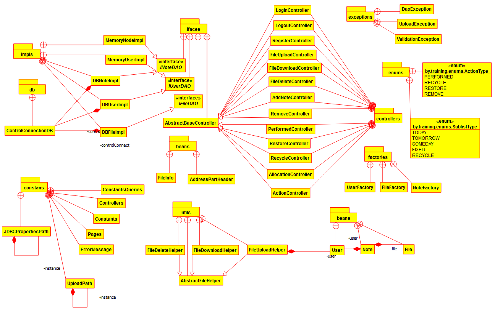  
  
**Схема связей** таблиц БД:  

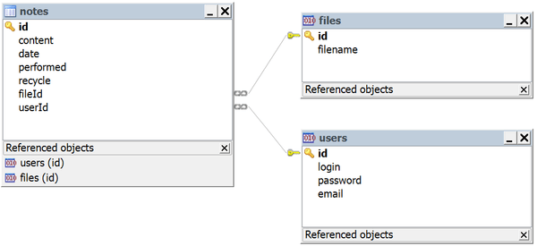

## Сборка приложения (war-архива) в CMD:
Для компиляции/сборки приложения в ОС требуется установленная JDK версии 7 или выше.  
В переменных окружения ОС должны быть прописаны пути к JDK (Для компиляции и запуска из CMD).  
Также, в переменных окружения должен быть прописан путь к каталогу контейнера Tomcat `CATALINA_HOME` и в `Path` добавлен `%CATALINA_HOME%\bin`.
Также требуется установленная БД MySQL версии 5.1 или выше, либо доступ к удалённой БД MySQL. База данных, во время последующего запуска системы, должна быть создана из приложенных скриптов и запущена. Также нужно изменить логин/пароль/хост/порт подключения к БД в файле свойств: `WebContent\WEB-INF\jdbc.properties`.
* 1. Для компиляции и сборки приложения, в структуру каталогов следует добавить каталог для размещения скомпилированных java-классов. Структурой war-архивов указано, что каталог *classes* должен располагаться в каталоге *WEB-INF*. В *cmd* можно воспользоваться коммандой:  
`mkdir WebContent\WEB-INF\classes`  
* 2. При компиляции java-файлов в class-файлы, следует указать путь к библиотеке сервлетов из Tomcat (используется путь относительно *CATALINA_HOME*), а также пути к пакетам с классами в системе. Библиотека сервлетов (servlet-api.jar) в Tomcat 5.5 располагается в `%CATALINA_HOME%\common\lib\`. В более поздних версиях контейнера (6 и выше) - в `%CATALINA_HOME%\lib\`. Следовательно компиляция:  
  Для **Tomcat 5.5**:  
`javac -encoding utf-8 -classpath ./src;%CATALINA_HOME%\common\lib\servlet-api.jar -d ./WebContent/WEB-INF/classes src/by/training/constans/*.java src/by/training/controllers/*.java src/by/training/enums/*.java src/by/training/exceptions/*.java src/by/training/ifaces/*.java src/by/training/model/beans/*.java src/by/training/model/db/*.java src/by/training/model/factories/*.java src/by/training/model/impls/*.java src/by/training/utils/*.java src/by/training/utils/beans/*.java`  
  Для **Tomcat 6** и выше:  
`javac -encoding utf-8 -classpath ./src;%CATALINA_HOME%\lib\servlet-api.jar -d ./WebContent/WEB-INF/classes src/by/training/constans/*.java src/by/training/controllers/*.java src/by/training/enums/*.java src/by/training/exceptions/*.java src/by/training/ifaces/*.java src/by/training/model/beans/*.java src/by/training/model/db/*.java src/by/training/model/factories/*.java src/by/training/model/impls/*.java src/by/training/utils/*.java src/by/training/utils/beans/*.java`
* 3. Далее требуется собрать war-архив. Для этого из каталога *WebContent* запускаем комманду:  
`jar -cvf TodoList.war *`

Для упрощения ввода вышеперечисленных команд в *cmd*, в корне каталогов с проектами находятся<br>скрипты *compile and build (tomcat 5.5).bat* и *compile and build (tomcat 6 and above).bat*.

## Развёртывание war-архива в локальном контейнере Tomcat:
В переменных окружения должен быть прописан путь к каталогу контейнера Tomcat `CATALINA_HOME` и в `Path` добавлен `%CATALINA_HOME%\bin`.  
Для развёртывания приложений в Apache Tomcat есть 2 пути: ручное копирование war-архива, либо использование *Tomcat Web Application Manager* (более гибкое решение).  
* 1. Ручное копирование war: просто скопировать сгенерированный war в `%CATALINA_HOME%\webapps\`.  
Если Tomcat в данный момент запущен, то через пару секунд он сам должен развернуть веб-приложение из архива. При этом он создаст одноимённые папки в `%CATALINA_HOME%\webapps\` для размещения приложения и в `%CATALINA_HOME%\work\Catalina\localhost\` для размещения скомпилированных jsp. Также Tomcat может создать конфигурационный xml-файл в `%CATALINA_HOME%\conf\Catalina\localhost\`.  
Если Tomcat в данный момент не запущен, то он совершит вышеуказанные действия при последующем запуске.  
Приложение будет доступно по адресу:  
`http://localhost:8080/TodoList/`  
В случае, если потребуется развёртывание изменённой версии приложения, то нужно лишь заменить war-архив в `%CATALINA_HOME%\webapps\` - через пару секунд Tomcat развернёт новую версию.  
В случае, если нужно удалить веб-приложение из контейнера, нужно удалить этот war-архив и одноимённую папку, папку со скомпилированными jsp и конфигурационный файл.
* 2. Развёртывание через *Tomcat Web Application Manager* (способ проверялся только в Tomcat 8): для использования этого способа в Apache Tomcat  требует пользователь с ролью *manager-gui*.
  * 2.1. Для того, чтобы создать пользователя (либо узнать логин/пароль) нужно открыть файл `%CATALINA_HOME%\conf\tomcat-users.xml`. Если в файле нет пользователя с такой ролью, можно добавить и перезапустить контейнер:  
  `<user username="admin" password="12345" roles="manager-gui" />`
  * 2.2. Теперь нужно авторизоваться в системе.  
  Переходим по адресу *http://localhost:8080/*, кликаем *Manager App* и вводим логин/пароль.
  * 2.3. На вкладке *Deploy* выбираем нужный war-архив и нажимаем *deploy* - приложение спустя пару секунд должно развернуться и появиться в таблице *Applications*. Также в этой таблице присутсвуют ссылка на развёрнутое приложение, текущий статус, указание количества активных сессий и комманды управления приложением: *Start/Stop*, *Reload*, *Undeploy*.

Для упрощения ручного копирования, в корне каталога с проектом находятся скрипты *deploy.bat* и *undeploy.bat*.

## Импорт и запуск проекта в IDE (Eclipse и NetBeans)
Для импорта и запуска проекта в IDE должен быть доступ к MySQL, а база данных должна быть создана и запущена. Также нужно изменить логин/пароль/хост/порт подключения к БД в файле свойств:  
`WebContent\WEB-INF\jdbc.properties`.  
* **Eclipse**.
  * 1.Если в IDE не указана ссылка на контейнер, нужно *добавить* Tomcat в Eclipse. Для этого:
    * 1.1.Переключить перспективу на Java EE: *Window &rarr; Perspective &rarr; Open perspective &rarr; Other &rarr; Java EE*.
    * 1.2.Перейти на вкладку *Servers*: *Window &rarr; Show View &rarr; Servers*.
    * 1.3.Кликнуть по ссылке *No server are available*, выбрать нужную версию Tomcat и указать путь к нему.
  * 2.Создать новый *Dynamic Web Project*: *File &rarr; New &rarr; Other &rarr; Web &rarr; Dynamic Web Project*.
  * 3.Импортировать исходники в созданный проект: *File &rarr; Import &rarr; General &rarr; File System*.  
  Требуется указать только каталоги *src* и *WebContent*.
  * 4.Для запуска проекта Tomcat не должен быть запущен, так как его запуск осуществляет IDE.  
  Кликаем *RunAs &rarr; Run on Server* и приложение запускается.  
  Управление сервером и приложением на сервере осуществляется из вкладки *Servers*.  
  В случае, когда запуск осуществляется вышеуказанным способом, приложение развёртывается не в каталоге Tomcat'а, а в воркспэйсе Eclipse и приложение не будет доступно после завершения работы IDE. 
  * 5.Также можно собрать war-архив через IDE и развернуть его в самостоятельно.  
  Для сборки war-архива: *Export &rarr; WAR file*.  
  Развёртывание war-архива в контейнере Tomcat описано выше в соответсвующем разделе.

* **NetBeans**.  
  * 1.Если в IDE не указана ссылка на контейнер, нужно *добавить* Tomcat в NetBeans.  
  Для этого: *Tools &rarr; Servers &rarr; Add Server...*  
  Затем выбрать нужную версию Tomcat и указать путь к нему.
  * 2.Создать новый Web Application проект из существующих исходников:  
  *File &rarr; New Project &rarr; Java Web &rarr; Web Application With Exiting Sources*  
  Затем нужно указать путь в корневой каталог проекта - IDE автоматичеки распознает структуру каталогов.
  * 3.Для запуска проекта Tomcat не должен быть запущен, так как его запуск осуществляет IDE.  
  В случае, когда запуск осуществляется из IDE, приложение развёртывается не в каталоге Tomcat'а, и приложение не будет доступно после завершения работы IDE.  
  * 4.Также можно собрать war-архив через IDE и развернуть его в самостоятельно.  
  Для сборки war-архива: *Run &rarr; Clean and Build Project (Shift+F11)*.  
  При этом в каталоге проекта *dist* создаётся war.  
  Развёртывание war-архива в контейнере Tomcat описано выше в соответсвующем разделе.

  В некоторых версиях Tomcat есть ошибка в конфигурационном файле, которая приводит к невозможности запуска сервера из NetBeans с ошибкой:  
  `'127.0.0.1*' is not recognized as an internal or external command`  
  Решение проблемы: в файле *%CATALINA_HOME%\bin\catalina.bat* убрать двойные кавычки из строк:  
  ```
  :noJuliConfig
  set "JAVA_OPTS=%JAVA_OPTS% %LOGGING_CONFIG%"
  
  :noJuliManager
  set "JAVA_OPTS=%JAVA_OPTS% %LOGGING_MANAGER%"
  ```
  Описание дефекта (Tomcat): https://bz.apache.org/bugzilla/show_bug.cgi?id=56895  
  Описание дефекта (NetBeans): https://netbeans.org/bugzilla/show_bug.cgi?id=248182  
  Описание решения: https://stackoverflow.com/questions/26485487/error-starting-tomcat-from-netbeans-127-0-0-1-is-not-recognized-as-an-inter


## Демонстрационные скриншоты:

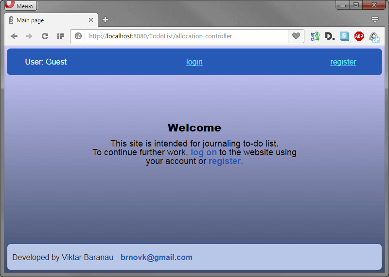  
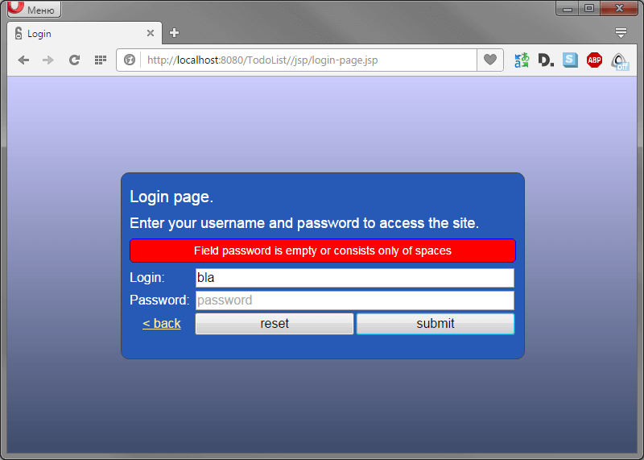  
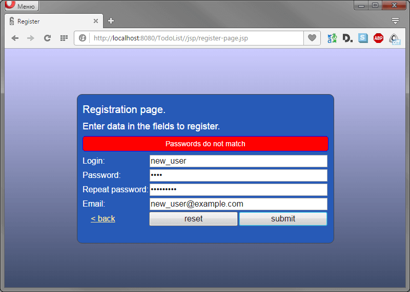  
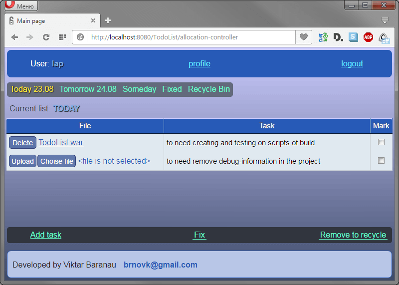  
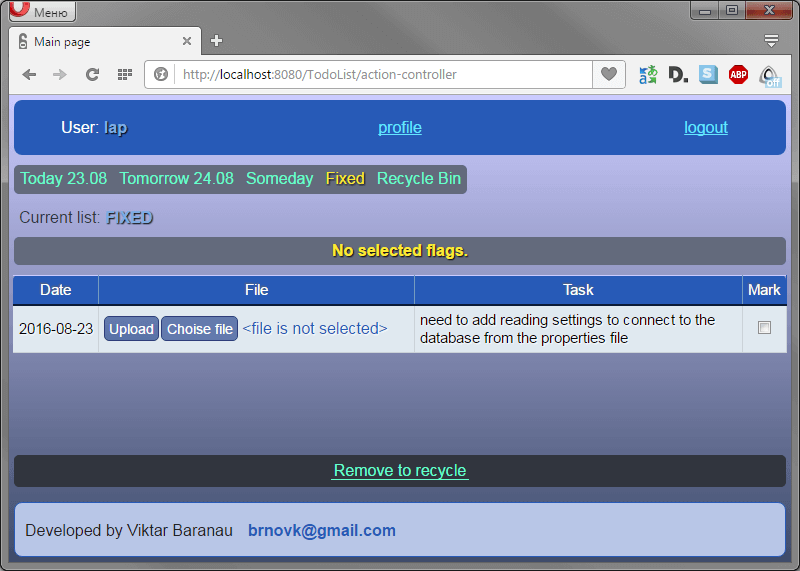  
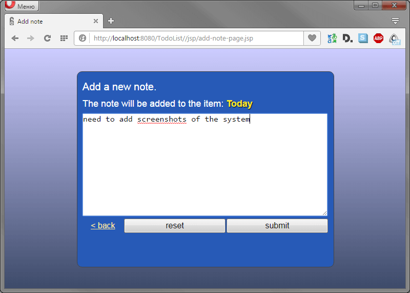  
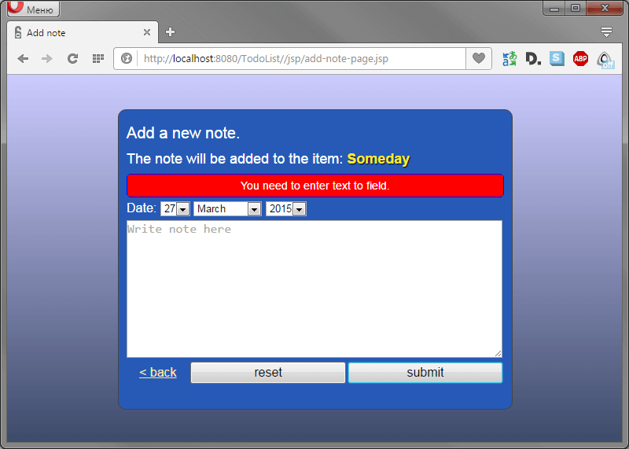  
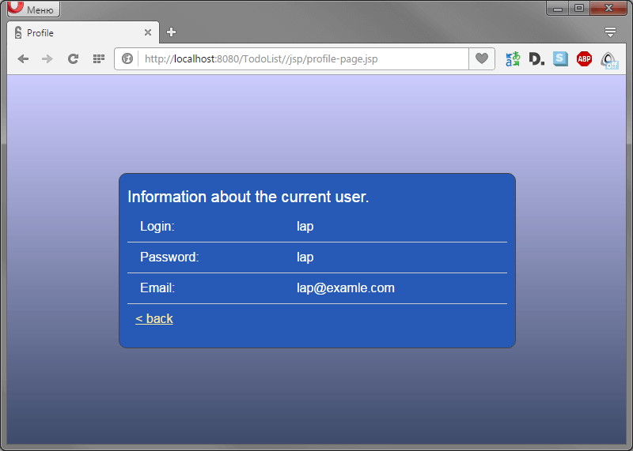  
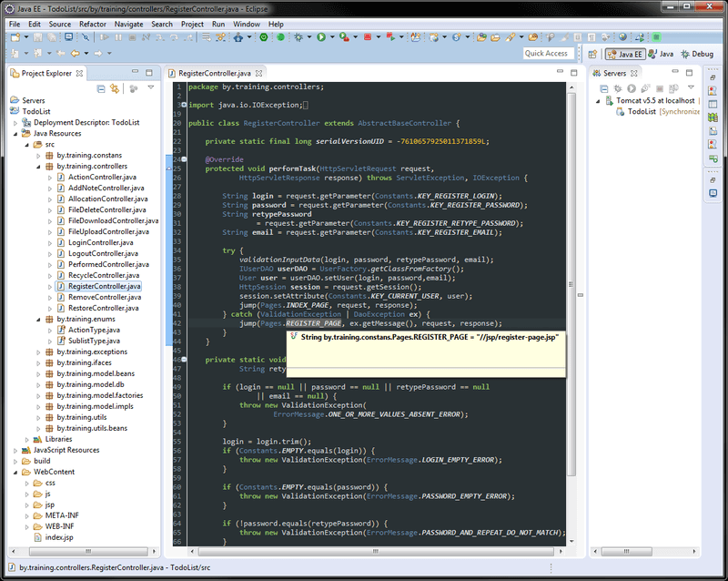  
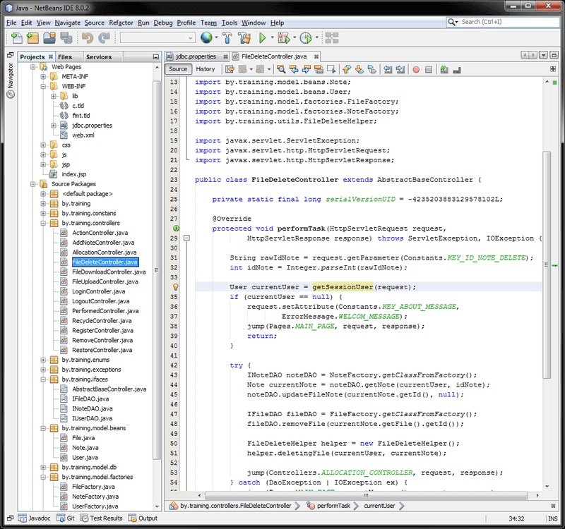  
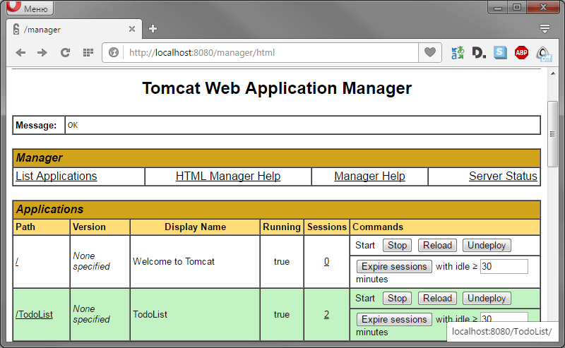  
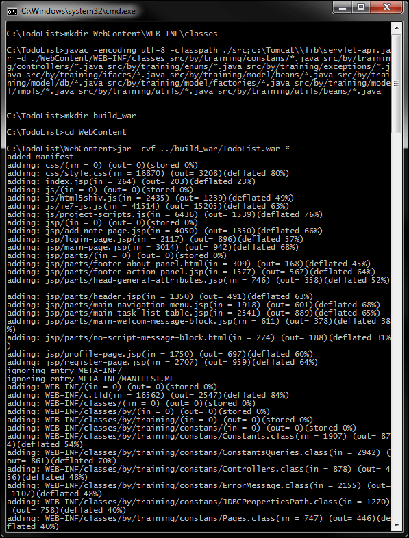
